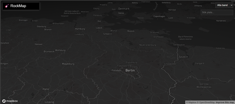

# RockMap 🎸🗺️

RockMap is an interactive web map that shows where major bands are performing concerts around the world.

🌐 **Live demo:** [https://randomizer.github.io/rockmap/](https://randomizer.github.io/rockmap/)

---

## Features

- 📍 Interactive Mapbox map
- 🗓️ Filter concerts by **month**
- 🌍 Filter concerts by **country** (auto-generated list)
- 💬 Popup markers with **artist, venue, city, date, and ticket link**
- ⚡ Lightweight: pure HTML, CSS, and JavaScript
- 🗂️ Data loaded from `events.json`

---

## How to Run Locally

1. Clone or download this repository
2. Open `index.html` in any modern web browser
3. The map will load using the public Mapbox token included in the project

---

## Project Structure

rockmap/
├── index.html # Main web page
├── events.json # Sample concert data
├── README.md # Project documentation
---

## Roadmap

- [ ] Artist filtering  
- [ ] Band logos in popups  
- [ ] Clustering for dense city areas  
- [ ] Automatic data updates via Bandsintown API  
- [ ] Hosting under a custom domain (rockmap.com)

---

## Credits

- [Mapbox GL JS](https://www.mapbox.com/mapbox-gl-js) for map rendering  
- Concert data: Sample/mock data for now (can be replaced with Bandsintown or Ticketmaster API)

---

🎸 **RockMap is live and evolving – enjoy exploring the world of live music!**

